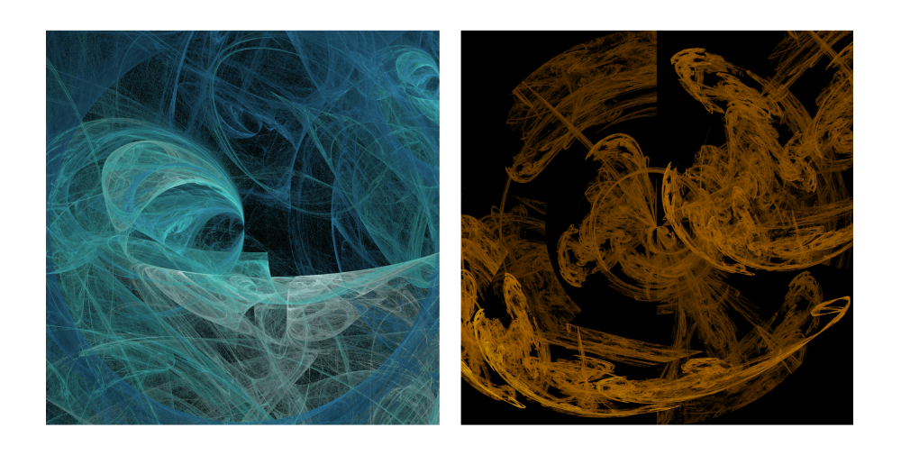
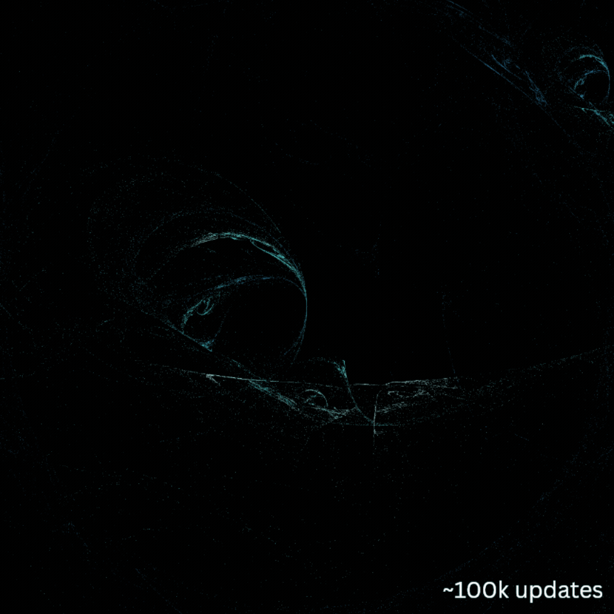

# 🐦 robin
### *High performance multi-threaded software renderer for fractal flames*
A [fractal flame](https://en.wikipedia.org/wiki/Fractal_flame) is an abstract artwork generated by *repeated applying random mathematical functions* to points in 2D space. After applying color to the image, the result is a visually striking organic pattern. This design is largely based on [the original paper by Scott Draves and Erik Reckase (2003)](https://flam3.com/flame_draves.pdf)

<br>

Application screenshots:


## 🧩 Key features:
- *High performance multi-threaded rendering engine*
- Support for 16 different transformation functions used in image generation
- Customizable, high resolution color gradients
- Detailed command line configurations
- JSON schema format for composable, plug-and-play image specifications
- Real time screenshotting
- Linux and Windows support

## 🔨 Building:
This project uses CMake and C++20. All external dependencies are automatically fetched and configured during the build process.
<br>
### Prerequisites:
**CMake**: Version 3.21 or higher.
<br>
**Compiler**: A C++20 compatible compiler (e.g., GCC 10+, Clang 10+, or MSVC 19.29+).

### Building from Source:
1. Clone the repository:
```bash
git clone https://github.com/davidmenggx/robin
cd robin
```
2. Configure the build:
```bash
cmake -B build -S . -DCMAKE_BUILD_TYPE=Release
```
3. Build the project:
```bash
cmake --build build --config Release
```

## ⚙️ Running:
Default execution is with no flags and no options specified
```bash
cd build
./robin [FLAGS] [OPTIONS]
```
<br>

**Controls:**
- Press ***[esc]*** to exit while running. May have slight delay if using multiple threads
- Press ***[s]*** to capture screenshot of current render. May incur temporary performance drop

<br>

**Optional Argument Reference:**
| **Argument**             	| **Type**    	| **Default**   	| **Description**                                                             	|
|--------------------------	|-------------	|---------------	|-----------------------------------------------------------------------------	|
| `--show-telemetry`, `-s` 	| **Flag**    	| `false`       	| Opens separate telemetry GUI window showing relevant performance statistics 	|
| `--threads`, `-t`        	| **Integer** 	| CPU Cores - 1 	| Number of worker threads used in rendering                                  	|
| `--fullscreen`, `-f`     	| **Flag**    	| `false`       	| Opens rendering window in full screen                                       	|
| `--width`                	| **Integer** 	| `800`         	| Width of rendering window (if not full screen)                              	|
| `--height`               	| **Integer** 	| `800`         	| Height of rendering window (if not full screen)                             	|
| `--input`, `-i`          	| **String**  	| `input.json`  	| Input filename for image specification.  Leave empty for default image      	|
| `--output`, `-o`         	| **String**  	| `output`      	| Output filename for saved flame, as a PNG file                              	|

## 🔥 Optimization and Performance
The initial render appears sparse, and is populated over time by numerous engine iterations
<br>
On average, a robust image appears after ***500 million to 1 billion engine iterations***
<br> <br>
In my analysis, I use the ***number of engine iterations per second*** as a proxy for performance
<br>
<p align="center">
  
</p>

The initial implementation (release v1.0.0) achieved only **16 million engine iterations per second**
<br>
The latest implementation (release v2.0.0) achieves ***40 - 50 million engine iterations per second***, or a speedup of up to 212.5%

---

### ⚡ Algorithmic performance optimizations in the rendering loop:
*Key runtime hotspots profiled using Intel VTune*
1) Replace cumulative distribution function lookup (previously O(logN) binary search) with pre-computed [alias table](https://en.wikipedia.org/wiki/Alias_method) (O(1))
2) Replace Mersenne Twister random number generator with lightweight [xoshiro256++](https://en.wikipedia.org/wiki/Xorshift#xoshiro256++)
3) Pre-compute and generate lookup table for color gradient instead of relying on runtime linear interpolation
4) Compute expensive functions (arctan) as little as possible, resuing results
5) Unrolling matrix multiplications

### 🏗️ Architectural performance optimizations:
*Key runtime hotspots profiled using Intel VTune*
1) Implement image buffer using ***Array of Structures (AoS) for better cache locality*** to accomodate the random selection nature of rendering algorithm. (For reference, a Structure of Arrays (SoA) approach was over 2 times slower)
2) Give each worker a separate image buffer to operate on, then join periodically with the main thread. ***This was over 1.5 times faster than having all workers operate on a single image buffer of atomics, largely due to optimization 1 (above)***
3) Introduce random noise to number of iterations each worker performed, ***increasing average CPU utilization by 16%***
4) [Experimental, marginal image quality degradation] Cache results of gradient color lookup for pixels within a similar region. Previously, this color lookup was highly memory bound, resulting in an **L2 cache miss 82% of the time**
